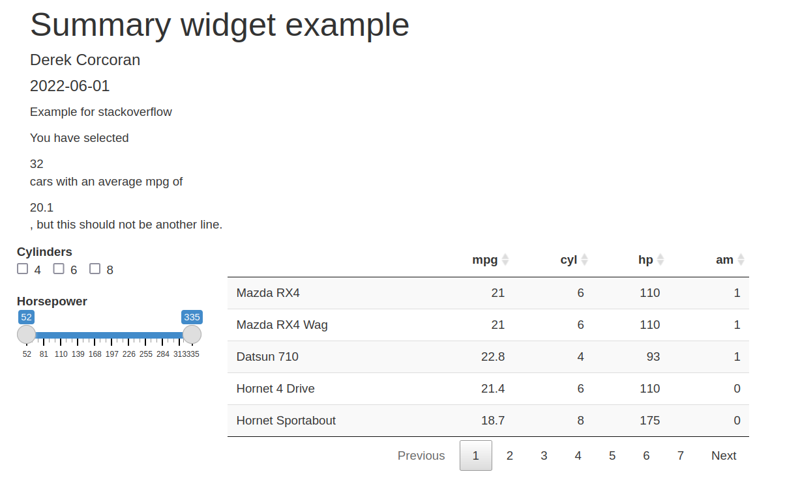
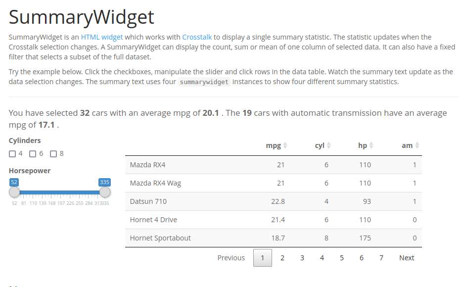

```{r reprex-options, include = FALSE}
options(
  keep.source = TRUE,
  rlang_trace_top_env = globalenv(),
  `rlang:::force_unhandled_error` = TRUE,
  rlang_backtrace_on_error = "full",
  crayon.enabled = FALSE,
  reprex.current_venue = "gh"
)
```

```{r, results = 'asis', echo = FALSE, include = file.exists('.Rprofile'), eval = file.exists('.Rprofile')}
cat(sprintf("*Local `.Rprofile` detected at `%s`*", normalizePath(".Rprofile")))
```

---
output:
  reprex::reprex_document:
    venue: "gh"
    advertise: FALSE
    session_info: TRUE
    style: TRUE
    comment: "#;-)"
    tidyverse_quiet: TRUE
    std_out_err: TRUE
knit: reprex::reprex_render
---

# Can't get summarywidget output as inline

I have been using the `crosstalk` package, and I am a big fan, however, I have the issue that I can`t seem to understand how to put the output of the package in an inline code. The webpage states the following:

**The output of summarywidget is enclosed in a <span> tag so you can use it inline in text. See the Introduction for an example.**

However I made [this example](https://github.com/derek-corcoran-barrios/SummaryWidgetQuestion/blob/master/example.Rmd) shown in this repository, and published in [this rpubs](https://rpubs.com/derek_corcoran/SummaryWidget). And it can be seen that the outputs are not an inline code, as seen in this image:

```{r myimage, echo=FALSE}

```

But when I see the result of the package [example page](https://kent37.github.io/summarywidget/index.html) it is inline:

```{r theirimage, echo=FALSE}

```

But I copied exactly their code, any idea on what I am doing wrong?


<details style="margin-bottom:10px;">
<summary>Standard output and standard error</summary>
`/home/derek/Documents/SummaryWidgetQuestion/ReprexQuestion_reprex_std_out_err.txt`
</details>

<details style="margin-bottom:10px;">
<summary>Session info</summary>
```{r }
sessioninfo::session_info()
```
</details>
